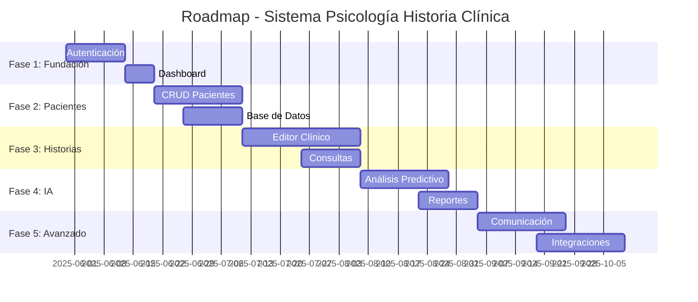

# 🏥 Sistema de Psicología - Historia Clínica

Sistema integral de gestión clínica desarrollado con arquitectura de microservicios, diseñado para profesionales de la salud mental que necesitan una plataforma completa para la gestión de pacientes, historias clínicas y análisis de datos.


## 📋 Tabla de Contenidos

- [🎯 Descripción del Proyecto](#-descripción-del-proyecto)
- [🏗️ Arquitectura del Sistema](#️-arquitectura-del-sistema)
- [🛠️ Stack Tecnológico](#️-stack-tecnológico)
- [📁 Estructura del Proyecto](#-estructura-del-proyecto)
- [🚀 Instalación y Configuración](#-instalación-y-configuración)
- [✅ Estado Actual](#-estado-actual)
- [🔮 Funcionalidades Planificadas](#-funcionalidades-planificadas)
- [📊 Roadmap de Desarrollo](#-roadmap-de-desarrollo)
- [🐳 Comandos Docker](#-comandos-docker)
- [🧪 Testing](#-testing)
- [📝 Contribución](#-contribución)
- [📄 Licencia](#-licencia)

## 🎯 Descripción del Proyecto

**Sistema de Psicología - Historia Clínica** es una plataforma web moderna diseñada para facilitar la gestión integral de consultas psicológicas. El sistema permite a los profesionales de la salud mental administrar pacientes, crear y mantener historias clínicas digitales, generar reportes estadísticos y utilizar inteligencia artificial para análisis predictivos.

### 🎪 Características Principales

- **Gestión de Pacientes**: Registro completo y seguimiento de pacientes
- **Historias Clínicas Digitales**: Creación, edición y almacenamiento seguro
- **Dashboard Analítico**: Visualización de datos y métricas importantes
- **IA Integrada**: Análisis predictivo y recomendaciones automáticas
- **Seguridad Avanzada**: Autenticación JWT y control de acceso
- **Responsive Design**: Optimizado para desktop, tablet y móvil
- **API RESTful**: Arquitectura escalable y bien documentada

## 🏗️ Arquitectura del Sistema

```
┌─────────────────────────────────────────────────────────────┐
│                    FRONTEND (Angular 19)                    │
│                     Puerto: 4200                           │
└─────────────────────┬───────────────────────────────────────┘
                      │
                      ▼
┌─────────────────────────────────────────────────────────────┐
│                 API GATEWAY / NGINX                        │
└─────────────────────┬───────────────────────────────────────┘
                      │
        ┌─────────────┼─────────────┐
        ▼             ▼             ▼
┌─────────────┐ ┌─────────────┐ ┌─────────────┐
│   BACKEND   │ │ AI SERVICE  │ │  DATABASE   │
│ ASP.NET Core│ │Python Flask │ │ PostgreSQL  │
│ Puerto: 5000│ │Puerto: 7000 │ │Puerto: 5432 │
└─────────────┘ └─────────────┘ └─────────────┘
```

### 🔄 Flujo de Datos

1. **Frontend** (Angular) → Interface de usuario y lógica de presentación
2. **Backend** (ASP.NET Core) → API RESTful, lógica de negocio y autenticación
3. **Database** (PostgreSQL) → Almacenamiento persistente de datos
4. **AI Service** (Python) → Procesamiento de IA y análisis predictivo

## 🛠️ Stack Tecnológico

### **Frontend**
- **Framework**: Angular 19 (Standalone Components)
- **Language**: TypeScript 5.6
- **Styling**: CSS3 + Responsive Design
- **Build Tool**: Angular CLI + Webpack
- **State Management**: Planned (NgRx)

### **Backend**
- **Framework**: ASP.NET Core 8.0
- **Language**: C# 12
- **Architecture**: Clean Architecture + CQRS
- **Authentication**: JWT Bearer Tokens
- **API Documentation**: Swagger/OpenAPI

### **Database**
- **Primary DB**: PostgreSQL 14
- **ORM**: Entity Framework Core
- **Migrations**: Code-First Approach
- **Connection Pooling**: Built-in EF Core

### **AI/ML Service**
- **Framework**: Python Flask
- **ML Libraries**: Scikit-learn, TensorFlow (Planned)
- **Data Processing**: Pandas, NumPy
- **API Format**: RESTful JSON

### **DevOps & Infrastructure**
- **Containerization**: Docker + Docker Compose
- **Web Server**: Nginx (Production)
- **Development Server**: Angular CLI Dev Server
- **Version Control**: Git

## 📁 Estructura del Proyecto

```
psicologia-historia-clinica/
├── 📂 frontend/                 # Angular 19 Application
│   ├── 📂 src/
│   │   ├── 📂 app/
│   │   │   ├── 📄 app.component.ts
│   │   │   ├── 📄 app.config.ts
│   │   │   └── 📄 app.routes.ts
│   │   ├── 📄 index.html
│   │   ├── 📄 main.ts
│   │   └── 📄 styles.css
│   ├── 📄 angular.json
│   ├── 📄 package.json
│   ├── 📄 Dockerfile
│   └── 📄 .dockerignore
├── 📂 backend/                  # ASP.NET Core API
│   ├── 📂 Controllers/
│   ├── 📂 Models/
│   ├── 📂 Services/
│   ├── 📄 Program.cs
│   └── 📄 Dockerfile
├── 📂 ai_service/              # Python Flask AI Service
│   ├── 📂 models/
│   ├── 📄 app.py
│   ├── 📄 requirements.txt
│   └── 📄 Dockerfile
├── 📂 db/                      # Database Scripts
│   └── 📄 init.sql
├── 📄 docker-compose.yml      # Multi-container orchestration
└── 📄 README.md              # This file
```

## 🚀 Instalación y Configuración

### **Prerrequisitos**

- **Docker** (v20.0+)
- **Docker Compose** (v2.0+)
- **Git**

### **Instalación Rápida**

```bash
# 1. Clonar el repositorio
git clone <repository-url>
cd psicologia-historia-clinica

# 2. Construir todos los servicios
docker compose build

# 3. Ejecutar la aplicación completa
docker compose up

# 4. Acceder a la aplicación
# Frontend: http://localhost:4200
# Backend API: http://localhost:5000
# AI Service: http://localhost:7000
# Database: localhost:5432
```

### **Desarrollo Local (Sin Docker)**

```bash
# Frontend
cd frontend
npm install
npm start

# Backend
cd backend
dotnet restore
dotnet run

# AI Service
cd ai_service
pip install -r requirements.txt
python app.py
```

## ✅ Estado Actual

### **🟢 Completado**

- ✅ **Configuración inicial del proyecto**
  - Docker Compose configurado
  - Estructura de microservicios
  - Red interna de comunicación

- ✅ **Frontend (Angular 19)**
  - Proyecto Angular inicializado con Angular CLI
  - Standalone components configurados
  - Diseño responsivo con gradientes modernos
  - Página de estado del sistema
  - Build optimizado para producción

- ✅ **Backend (ASP.NET Core)**
  - API básica configurada
  - Conexión a base de datos PostgreSQL
  - Estructura de proyecto limpia

- ✅ **Base de Datos (PostgreSQL)**
  - Contenedor configurado
  - Scripts de inicialización
  - Persistencia de datos

- ✅ **AI Service (Python Flask)**
  - Servicio básico funcionando
  - API REST configurada
  - Contenedor optimizado

### **📸 Screenshots**

**Dashboard Principal:**
- Header con gradiente azul/púrpura profesional
- 4 tarjetas de estado (Frontend, Backend, Database, AI Service)
- Badges verdes "Activo" confirmando servicios operativos
- Diseño moderno y responsive

## 🔮 Funcionalidades Planificadas

### **🔵 Fase 1: Fundación (2-3 semanas)**

- **Autenticación y Autorización**
  - [ ] Sistema de login/logout
  - [ ] Registro de usuarios (psicólogos)
  - [ ] JWT token implementation
  - [ ] Guards de ruta en Angular
  - [ ] Roles y permisos

- **Dashboard Principal**
  - [ ] Métricas de pacientes activos
  - [ ] Gráficos de consultas por mes
  - [ ] Indicadores de rendimiento
  - [ ] Navegación principal

### **🟡 Fase 2: Gestión de Pacientes (3-4 semanas)**

- **CRUD de Pacientes**
  - [ ] Formulario de registro de pacientes
  - [ ] Lista paginada de pacientes
  - [ ] Búsqueda y filtros avanzados
  - [ ] Perfiles detallados de pacientes
  - [ ] Historial de consultas

- **Base de Datos**
  - [ ] Modelos de datos completos
  - [ ] Migrations automáticas
  - [ ] Relaciones entre entidades
  - [ ] Índices optimizados

### **🟠 Fase 3: Historias Clínicas (4-5 semanas)**

- **Editor de Historias Clínicas**
  - [ ] Formularios dinámicos
  - [ ] Templates predefinidos
  - [ ] Editor de texto enriquecido
  - [ ] Adjuntos de archivos
  - [ ] Versionado de documentos

- **Gestión de Consultas**
  - [ ] Calendario de citas
  - [ ] Notas de sesión
  - [ ] Planes de tratamiento
  - [ ] Seguimiento de progreso

### **🟣 Fase 4: Inteligencia Artificial (3-4 semanas)**

- **Análisis Predictivo**
  - [ ] Análisis de sentiment en notas
  - [ ] Predicción de riesgo
  - [ ] Recomendaciones de tratamiento
  - [ ] Detección de patrones

- **Reportes Automáticos**
  - [ ] Generación de informes
  - [ ] Estadísticas avanzadas
  - [ ] Exportación a PDF
  - [ ] Dashboards personalizados

### **🔴 Fase 5: Funcionalidades Avanzadas (4-6 semanas)**

- **Comunicación**
  - [ ] Sistema de mensajería interna
  - [ ] Notificaciones push
  - [ ] Recordatorios automáticos
  - [ ] Portal del paciente

- **Integrations**
  - [ ] API externa para telemedicina
  - [ ] Integración con calendarios
  - [ ] Backup automático
  - [ ] Sync con sistemas externos

## 📊 Roadmap de Desarrollo



## 🐳 Comandos Docker

### **Comandos Básicos**

```bash
# Construir todos los servicios
docker compose build

# Construir un servicio específico sin caché
docker compose build --no-cache frontend

# Ejecutar todos los servicios
docker compose up

# Ejecutar en segundo plano
docker compose up -d

# Ejecutar un servicio específico
docker compose up frontend

# Parar todos los servicios
docker compose down

# Ver logs de un servicio
docker compose logs frontend

# Ver logs en tiempo real
docker compose logs -f frontend
```

### **Comandos de Mantenimiento**

```bash
# Limpiar imágenes no utilizadas
docker image prune

# Limpiar todo el sistema Docker
docker system prune -a

# Ver servicios corriendo
docker compose ps

# Acceder a un contenedor
docker compose exec frontend bash
docker compose exec backend bash

# Reiniciar un servicio específico
docker compose restart frontend
```

## 🧪 Testing

### **Frontend Testing**

```bash
cd frontend

# Unit tests
npm test

# E2E tests
npm run e2e

# Coverage report
npm run test:coverage
```

### **Backend Testing**

```bash
cd backend

# Unit tests
dotnet test

# Integration tests
dotnet test --filter Category=Integration

# Coverage report
dotnet test --collect:"XPlat Code Coverage"
```

### **AI Service Testing**

```bash
cd ai_service

# Unit tests
python -m pytest

# Coverage
python -m pytest --cov=app
```

## 📝 Contribución

### **Flujo de Trabajo**

1. **Fork** el repositorio
2. **Crear** una rama feature (`git checkout -b feature/nueva-funcionalidad`)
3. **Commit** los cambios (`git commit -m 'Add: nueva funcionalidad'`)
4. **Push** a la rama (`git push origin feature/nueva-funcionalidad`)
5. **Crear** un Pull Request

### **Estándares de Código**

- **Angular**: Seguir Angular Style Guide
- **C#**: Seguir .NET Coding Conventions
- **Python**: Seguir PEP 8
- **Git**: Conventional Commits

### **Requerimientos de PR**

- [ ] Tests unitarios actualizados
- [ ] Documentación actualizada
- [ ] Build sin errores
- [ ] Code review aprobado

## 🏆 Contribuidores

- **Desarrollador Principal**: Pablo Andres Muñoz
- **Frontend**: Angular Team
- **Backend**: .NET Team
- **AI/ML**: Python Team

## 📞 Soporte

Para soporte técnico o preguntas:

- **Email**: ingenieropabloandres0@gmail.com
- **Issues**: pendiente
- **Documentación**: [Wiki del proyecto](./wiki)

## 📄 Licencia

Este proyecto está licenciado bajo la **MIT License** - ver el archivo [LICENSE](LICENSE) para más detalles.

---

## 🎯 Estado Actual del Desarrollo

**Última actualización**: Mayo 29, 2025

**Servicios funcionando**:
- ✅ Frontend (Angular 19) - http://localhost:4200
- ✅ Backend (ASP.NET Core) - http://localhost:5000  
- ✅ Database (PostgreSQL) - localhost:5432
- ✅ AI Service (Flask) - http://localhost:7000

**Próximo milestone**: Implementación del sistema de autenticación y dashboard principal.

---

*Desarrollado con ❤️ para profesionales de la salud mental*